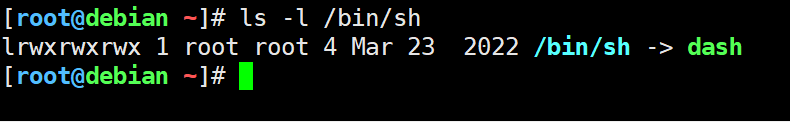

Redis.conf

```conf
bind 0.0.0.0
port 6379
dir /data
dbfilename dump.rdb
logfile "/var/log/redis.log"
loglevel notice
appendonly no
protected-mode yes
requirepass sais2025
save 900 1
save 300 10
save 60 10000
maxmemory 4gb 
maxmemory-policy allkeys-lru
maxmemory-samples 10


redis-cli
AUTH sais2025
```


mac移除gatekeeper

`sudo xattr -cr /Applications/*`

```shell
{
  "mcpServers": {
    "filesystem": {
      "command": "npx",
      "args": [
        "-y",
        "@modelcontextprotocol/server-filesystem",
        "/Users/xckcbxcvb/Documents",
        "/Users/xckcbxcvb/Downloads"
      ]
    }
  }
}


#登录接口
curl 'https://10.193.46.63/v3-public/localProviders/local?action=login' \
  -H 'Accept: application/json' \
  -H 'Accept-Language: zh-CN,zh;q=0.9,en;q=0.8' \
  -H 'Connection: keep-alive' \
  -H 'Content-Type: application/json' \
  -b 'R_PCS=light; R_LOCALE=en-us; R_REDIRECTED=true; CSRF=d42138beb294b03436730b69752e32ef' \
  -H 'Origin: https://10.193.46.63' \
  -H 'Referer: https://10.193.46.63/dashboard/auth/login?logged-out' \
  -H 'Sec-Fetch-Dest: empty' \
  -H 'Sec-Fetch-Mode: cors' \
  -H 'Sec-Fetch-Site: same-origin' \
  -H 'User-Agent: Mozilla/5.0 (Macintosh; Intel Mac OS X 10_15_7) AppleWebKit/537.36 (KHTML, like Gecko) Chrome/136.0.0.0 Safari/537.36' \
  -H 'sec-ch-ua: "Chromium";v="136", "Google Chrome";v="136", "Not.A/Brand";v="99"' \
  -H 'sec-ch-ua-mobile: ?0' \
  -H 'sec-ch-ua-platform: "macOS"' \
  -H 'x-api-csrf: d42138beb294b03436730b69752e32ef' \
  --data-raw '{"description":"UI session","responseType":"cookie","username":"zhangyunlei","password":"WgNcuUGnIDCjSdwj"}' \
  --insecure
  
  
#查询项目
curl 'https://10.193.46.63/v1/management.cattle.io.project/c-m-nbjlhlbr?exclude=metadata.managedFields' \
  -H 'Accept: application/json' \
  -H 'Accept-Language: zh-CN,zh;q=0.9,en;q=0.8' \
  -H 'Connection: keep-alive' \
  -b 'R_PCS=light; R_LOCALE=en-us; R_REDIRECTED=true; CSRF=d42138beb294b03436730b69752e32ef; R_SESS=token-bdqnp:qgbqrj2gtcclk4bj45bxrhv5hrsg6mcbxl4d6mxv7n9f9sqp9xmvsk' \
  -H 'Referer: https://10.193.46.63/dashboard/home' \
  -H 'Sec-Fetch-Dest: empty' \
  -H 'Sec-Fetch-Mode: cors' \
  -H 'Sec-Fetch-Site: same-origin' \
  -H 'User-Agent: Mozilla/5.0 (Macintosh; Intel Mac OS X 10_15_7) AppleWebKit/537.36 (KHTML, like Gecko) Chrome/136.0.0.0 Safari/537.36' \
  -H 'sec-ch-ua: "Chromium";v="136", "Google Chrome";v="136", "Not.A/Brand";v="99"' \
  -H 'sec-ch-ua-mobile: ?0' \
  -H 'sec-ch-ua-platform: "macOS"' \
  -H 'x-api-csrf: d42138beb294b03436730b69752e32ef' \
  --insecure
  
curl 'https://10.193.46.63/v3/users?me=true' \
  -H 'Accept: application/json' \
  -H 'Accept-Language: zh-CN,zh;q=0.9,en;q=0.8' \
  -H 'Connection: keep-alive' \
  -b 'R_PCS=light; R_LOCALE=en-us; R_REDIRECTED=true; CSRF=d42138beb294b03436730b69752e32ef; R_SESS=token-bdqnp:qgbqrj2gtcclk4bj45bxrhv5hrsg6mcbxl4d6mxv7n9f9sqp9xmvsk' \
  -H 'Referer: https://10.193.46.63/dashboard/auth/login?logged-out' \
  -H 'Sec-Fetch-Dest: empty' \
  -H 'Sec-Fetch-Mode: cors' \
  -H 'Sec-Fetch-Site: same-origin' \
  -H 'User-Agent: Mozilla/5.0 (Macintosh; Intel Mac OS X 10_15_7) AppleWebKit/537.36 (KHTML, like Gecko) Chrome/136.0.0.0 Safari/537.36' \
  -H 'sec-ch-ua: "Chromium";v="136", "Google Chrome";v="136", "Not.A/Brand";v="99"' \
  -H 'sec-ch-ua-mobile: ?0' \
  -H 'sec-ch-ua-platform: "macOS"' \
  -H 'x-api-csrf: d42138beb294b03436730b69752e32ef' \
  --insecure  

curl 'https://10.193.46.63/v3/projectroletemplatebindings' \
  -H 'Accept: application/json' \
  -H 'Accept-Language: zh-CN,zh;q=0.9,en;q=0.8' \
  -H 'Connection: keep-alive' \
  -H 'Content-Type: application/json' \
  -b 'R_PCS=light; R_LOCALE=en-us; R_REDIRECTED=true; CSRF=919eba3f0f44999afc36b7ca0f59980e; R_SESS=token-rsgwv:852k7r4bj5c6n6hjhmzk4f5sb9nlb6dqxcxdxm5m9phzw9vzsgn2gq' \
  -H 'Origin: https://10.193.46.63' \
  -H 'Referer: https://10.193.46.63/dashboard/c/c-m-nbjlhlbr/explorer/members' \
  -H 'Sec-Fetch-Dest: empty' \
  -H 'Sec-Fetch-Mode: cors' \
  -H 'Sec-Fetch-Site: same-origin' \
  -H 'User-Agent: Mozilla/5.0 (Macintosh; Intel Mac OS X 10_15_7) AppleWebKit/537.36 (KHTML, like Gecko) Chrome/136.0.0.0 Safari/537.36' \
  -H 'sec-ch-ua: "Chromium";v="136", "Google Chrome";v="136", "Not.A/Brand";v="99"' \
  -H 'sec-ch-ua-mobile: ?0' \
  -H 'sec-ch-ua-platform: "macOS"' \
  -H 'x-api-csrf: 919eba3f0f44999afc36b7ca0f59980e' \
  --data-raw '{"type":"projectroletemplatebinding","roleTemplateId":"read-only","userPrincipalId":"local://u-shr5c","projectId":"c-m-nbjlhlbr:p-r5hzr"}' \
  --insecure
  
curl -s --insecure \
  -H 'Accept: application/json' \
  -H 'Authorization: Bearer token-cs6rf:l7555k8k86k69rqtl5nrp8hfdnqlcpzdmx25wmb5n8cxztmnjvcbcn' \
  -H 'x-api-csrf: acec4a7bd0a1f042fc2e25bf6f9a866d' \
  'https://10.193.46.63/v3/users' | jq '.data[] | select(.username=="lipeisong") | .id' 
 
#创建新token
curl -s --insecure \
  -X POST \
  -H 'Accept: application/json' \
  -H 'Authorization: Bearer token-9pt7t:slmhxcxng62q4kzcxmsx4skxzlx2grn767cbjthbjvwmnh5tw7qjhc' \
  -H 'Content-Type: application/json' \
  -H 'x-api-csrf: acec4a7bd0a1f042fc2e25bf6f9a866d' \
  -d '{"userId":"u-mgmsf","description":"API token for <usernamechen>","ttl":0}' \
  'https://10.193.46.63/v3/tokens' | jq '.token'
  
curl -s --insecure \
  -H 'Accept: application/json' \
  -H 'Authorization: Bearer token-9pt7t:slmhxcxng62q4kzcxmsx4skxzlx2grn767cbjthbjvwmnh5tw7qjhc' \
  -H 'x-api-csrf: acec4a7bd0a1f042fc2e25bf6f9a866d' \
  'https://10.193.46.63/v3/tokens?userId=u-mgmsf' | jq '.data[] | {id, description, userId}'  
  
  
#验证token归属
curl -s --insecure \
  -X POST \
  -H 'Accept: application/json' \
  -H 'Authorization: Bearer token-9pt7t:slmhxcxng62q4kzcxmsx4skxzlx2grn767cbjthbjvwmnh5tw7qjhc' \
  -H 'Content-Type: application/json' \
  -H 'x-api-csrf: acec4a7bd0a1f042fc2e25bf6f9a866d' \
  -d '{"userId":"u-mgmsf","description":"API token for target_user","ttl":0}' \
  'https://10.193.46.63/v3/tokens' | jq '{token: .token, userId: .userId}'
  
  
  
curl -s --insecure \
  -X POST \
  -H 'Accept: application/json' \
  -H 'Authorization: Bearer token-cs6rf:l7555k8k86k69rqtl5nrp8hfdnqlcpzdmx25wmb5n8cxztmnjvcbcn' \
  -H 'Content-Type: application/json' \
  -H 'x-api-csrf: acec4a7bd0a1f042fc2e25bf6f9a866d' \
  -d '{"userId":"u-mgmsf","description":"API token for target_user","ttl":0}' \
  'https://10.193.46.63/v3/token' | jq '{token: .token, userId: .userId}'  
  
```


Gitlab目录挂载

```yaml
spec:
  template:
    spec:
      containers:
      - name: hallo2-deployment
        volumeMounts:
          - mountPath: /home/model-server/hallo2/pretrained_models
            name: nvme1
      volumes:
        - hostPath:
            path: /data/mount/nvme2/hallo2/pretrained_models
            type: DirectoryOrCreate
          name: nvme1
# ingress          
---
apiVersion: networking.k8s.io/v1
kind: Ingress
metadata:
  name: pathorisk-service-dev-ingress
  namespace: pathorisk
spec:
  ingressClassName: nginx
  rules:
  - host: pathorisk-dev.internal.sais.com.cn
    http:
      paths:
      - path: /
        pathType: Prefix
        backend:
          service:
            name: pathorisk-service-dev
            port:
              number: 8000
```


## scp模型文件拷贝

echo "ssh-rsa AAAAB3NzaC1yc2EAAAADAQABAAABAQCvqAtBifDWKxCaka6ud+6bKh1r5ad6EEzknkQPECEeNU3wxWECxIXivTrTCjLQqtSnq08BjphAoie0fWchBMeFHtH0vtcYceXhDGrHOec7+9E2oeRh/0kITGBC3ch8+qOL+qXgkG1QYkwwH0A+O0mwAqHLgYjEws05mJ1BBqYarK5GCZK1OV+jL7U4B0sy4uFM/F1ll0gta32NivHGJ1bfHz0U5iMoLcgZKsdZTtv+2gaq/qxC1PhWs0VpNZJ2GdjDWoxrFoAG6xSVb58K1CxuT8fB5m/fWdL9pHIGBJPBi6XQn65xFOUcPaG1ODid255iZD+x0aerBmSs2xfLF9e7 root@fudan-0003" >> ~/.ssh/authorized_keys

```sh
scp -rv root@10.193.6.95:"/cpfs01/projects-HDD/cfff-c7cd658afc74_HDD/public/zhangxingmeng/SpeechGPT-2.0-preview-Codec/*" .

scp -rv root@10.193.6.95:"/cpfs01/projects-HDD/cfff-c7cd658afc74_HDD/public/zhangxingmeng/SpeechGPT-2.0-preview-7B/*" .

scp -rv root@10.193.6.95:"/cpfs01/projects-HDD/fuhaiyang_HDD/public/fuhaiyang/*" .
scp -rv root@10.193.6.95:"/cpfs01/projects-HDD/cfff-85cad58c20e7_HDD/zhangxingmeng/downloads/gme-Qwen2-VL-7B-Instruct/*" .

ctr -n=k8s.io images pull --plain-http harbor.internal.sais.com.cn/public/rancher/shell:v0.1.23
ctr -n=k8s.io images tag harbor.internal.sais.com.cn/public/rancher/shell:v0.1.23 rancher/shell:v0.1.23


```


### 一、`nicolaka/netshoot` 的作用
`nicolaka/netshoot` 镜像的主要作用是提供一个集成了丰富网络诊断工具的容器环境，用于排查 Docker 和 Kubernetes 环境中的网络问题。它的核心优势在于：

1. **丰富的网络工具集**：  
   该镜像包含了大量网络调试工具，例如：
   - **基础工具**：`ping`、`curl`、`netstat`、`iproute2`、`iptables`、`tcpdump`、`nmap` 等。
   - **性能测试工具**：`iperf`、`iperf3`、`mtr`、`fping` 等。
   - **高级工具**：`scapy`、`tshark`、`ngrep`、`ethtool`、`conntrack-tools` 等。
   - **其他**：`vim`、`bash`、`openssl`、`drill`、`netcat` 等。
   这些工具几乎覆盖了所有常见的网络诊断场景，适合分析网络连接、性能、路由、防火墙规则等问题。

2. **支持网络命名空间切换**：  
   Kubernetes 的 Pod 内的容器共享同一个网络命名空间（Network Namespace），而 `netshoot` 可以通过 `--net container:<container_name>` 或 Kubernetes 的调试机制进入目标容器或主机的网络命名空间，执行诊断操作，而无需在目标容器中安装额外工具。

3. **灵活的调试场景**：  
   - **容器网络调试**：检查容器之间的网络连接、端口开放情况或网络性能。
   - **主机网络调试**：通过 `hostNetwork: true` 使用宿主机的网络命名空间，排查主机网络问题。
   - **Pod 间通信**：验证 Pod 间的网络通信是否正常。
   - **集群网络问题**：分析 Kubernetes 集群的 CNI（容器网络接口）配置或网络策略问题。

4. **无需修改目标容器**：  
   `netshoot` 可以作为一个独立的临时容器运行，避免在生产环境中修改业务容器的镜像或安装额外软件，从而保持容器精简和安全性。

### 二、在 Kubernetes 中使用 `nicolaka/netshoot` 的方法
以下是在 Kubernetes 环境中使用 `nicolaka/netshoot` 的几种常见方法，具体取决于你的调试场景：

#### 1. **以临时 Pod 运行 `netshoot`**
用于快速启动一个独立的调试 Pod，适合临时排查集群网络问题。

**命令**：
```bash
kubectl run tmp-netshoot --rm -it --image=nicolaka/netshoot -- /bin/bash
```

**说明**：
- `--rm`：Pod 使用完毕后自动删除。
- `-it`：以交互模式启动，进入容器 shell。
- `--image=nicolaka/netshoot`：指定 `netshoot` 镜像。
- `/bin/bash`：启动一个交互式 shell，允许运行各种网络工具（如 `ping`、`curl`、`iperf` 等）。

**示例**：
```bash
kubectl run tmp-netshoot --rm -it --image=nicolaka/netshoot -- /bin/bash
```
进入容器后，可以运行：
```bash
ping 8.8.8.8
netstat -tuln
iperf -c <target-pod-ip>
```

#### 2. **附加到现有 Pod 进行调试**
通过 `kubectl debug`，将 `netshoot` 作为临时容器附加到现有 Pod，共享目标 Pod 的网络命名空间。

**命令**：
```bash
kubectl debug -it <pod-name> --image=nicolaka/netshoot -- /bin/bash
```

**说明**：
- `<pod-name>`：目标 Pod 的名称。
- `--image=nicolaka/netshoot`：使用 `netshoot` 镜像作为调试容器。
- 启动后，`netshoot` 容器与目标 Pod 共享网络命名空间，可以直接访问目标 Pod 的网络栈。

**示例**：
假设有一个名为 `nginx-pod` 的 Pod：
```bash
kubectl debug -it nginx-pod --image=nicolaka/netshoot -- /bin/bash
```
进入后，可以运行：
```bash
netstat -an | grep LISTEN
tcpdump -i eth0
```
这可以检查 `nginx-pod` 的网络连接或捕获网络数据包。

**注意**：某些 Kubernetes 集群可能因安全策略（如 PodSecurity）限制 `kubectl debug`，需调整权限或使用其他方法。

#### 3. **使用 `hostNetwork` 调试主机网络**
当需要排查 Kubernetes 节点（宿主机）的网络问题时，可以启动一个使用主机网络命名空间的 `netshoot` Pod。

**示例 YAML**：
```yaml
apiVersion: v1
kind: Pod
metadata:
  name: netshoot-host
spec:
  hostNetwork: true
  containers:
  - name: netshoot
    image: nicolaka/netshoot
    command: ["sleep", "infinity"]
```

**部署命令**：
```bash
kubectl apply -f netshoot-host.yaml
kubectl exec -it netshoot-host -- /bin/bash
```

**说明**：
- `hostNetwork: true`：使 Pod 使用宿主机的网络命名空间。
- `sleep infinity`：保持容器运行以便进行交互式调试。
- 进入容器后，可以运行 `netstat`、`ip route` 或 `tcpdump` 来检查节点网络配置。

#### 4. **使用 `kubectl-netshoot` 插件**
`kubectl-netshoot` 是一个专门为 `netshoot` 设计的 kubectl 插件，简化了调试流程。

**安装插件**：
```bash
# 添加插件索引
kubectl krew index add netshoot https://github.com/nilic/kubectl-netshoot.git
# 安装插件
kubectl krew install netshoot/netshoot
```

**常用命令**：
- **启动临时 Pod**：
  ```bash
  kubectl netshoot run tmp-shell -it
  ```
- **调试现有 Pod**：
  ```bash
  kubectl netshoot debug <pod-name> -it
  ```
- **调试节点**：
  ```bash
  kubectl netshoot debug node/<node-name> -it
  ```

**说明**：
- 插件自动使用 `nicolaka/netshoot` 镜像，并支持自定义镜像或标签。
- 适合快速启动调试容器，减少手动编写 YAML 的工作量。

#### 5. **性能测试示例**
使用 `netshoot` 测试 Pod 间的网络性能，例如使用 `iperf`。

**步骤**：
1. 启动一个 `netshoot` 容器作为服务器：
   ```bash
   kubectl run iperf-server --image=nicolaka/netshoot -- /bin/bash -c "iperf -s -p 5001"
   ```
2. 获取服务器 Pod 的 IP：
   ```bash
   kubectl get pod iperf-server -o jsonpath='{.status.podIP}'
   ```
3. 启动另一个 `netshoot` 容器作为客户端：
   ```bash
   kubectl run iperf-client --rm -it --image=nicolaka/netshoot -- /bin/bash
   ```
4. 在客户端容器中运行：
   ```bash
   iperf -c <iperf-server-ip> -p 5001
   ```
   输出将显示两 Pod 之间的网络带宽和延迟。

### 三、使用注意事项
1. **权限问题**：某些工具（如 `tcpdump`）需要特权模式，可能触发 PodSecurity 限制。使用 `--privileged` 或调整安全上下文。
   ```bash
   kubectl run tmp-netshoot --rm -it --image=nicolaka/netshoot --privileged -- /bin/bash
   ```
2. **清理临时资源**：使用 `--rm` 或手动删除临时 Pod，避免资源浪费。
3. **镜像版本**：默认使用 `nicolaka/netshoot:latest`，可通过 `--image-tag` 指定版本（如 `v0.13`）。
4. **网络策略**：确保 Kubernetes 网络策略允许 `netshoot` Pod 与目标 Pod 或外部服务的通信。
5. **文档参考**：更多使用案例可参考官方 GitHub 仓库：https://github.com/nicolaka/netshoot。[](https://github.com/nicolaka/netshoot)

### 四、总结
`nicolaka/netshoot` 是一个功能强大的网络调试工具镜像，适用于 Kubernetes 和 Docker 环境的网络故障排查。通过临时 Pod、附加到现有 Pod、使用主机网络或插件方式，`netshoot` 提供了灵活的调试方法。其内置的丰富工具集和网络命名空间切换能力使其成为 Kubernetes 网络诊断的首选工具。

如果有具体场景或问题需要进一步说明，请提供更多细节，我可以为你定制更详细的指导！

## 问题记录

Shell脚本中包含 Bash 特有的数组语法（IMAGES=(...)），但如果脚本被 Dash 执行（例如通过 sh script.sh 或 /bin/sh 链接到 Dash），就会报错 Syntax error: "(" unexpected，因为 Dash 不支持数组。Ubuntu 22.04 默认将 /bin/sh 链接到 Dash，这解释了为什么脚本可能意外在 Dash 下运行。





```sh
bash script.sh
#或确保脚本有执行权限并直接运行：
chmod +x script.sh
./script.sh
```


